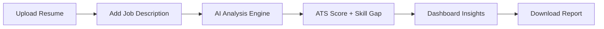

# 🚀 💎 TalentLens AI — Smart Resume Analyzer

> 🧠 *See your resume the way recruiters do.*

<p align="center">
  
  
  
  
</p>

---

## ✨ Overview

**TalentLens AI** is a full-stack AI-powered resume analyzer that evaluates resumes against job descriptions to generate ATS scores, detect skill gaps, and provide actionable feedback — all inside a modern SaaS-style dashboard.

---

## 🔥 Features

* 📄 Resume Parsing from PDF
* 🎯 ATS Score Calculation
* 📊 Job Match Analysis
* 🧠 Skill Gap Detection
* 💡 AI Feedback Suggestions
* 📈 Score Breakdown
* 📄 PDF Report Export
* 🧭 Step-by-Step User Flow
* 📁 Analysis History Tracking

---

## 🧠 How It Works



---

## 🛠️ Tech Stack

### ⚛️ Frontend

* React.js
* CSS (Glass UI)
* Axios
* Framer Motion
* Recharts

### ⚙️ Backend

* FastAPI
* Python
* pdfplumber
* spaCy

---

## 📂 Project Structure

```
ai-resume-analyzer/
│
├── backend/
│   ├── main.py
│   ├── requirements.txt
│
├── frontend/
│   ├── src/
│   │   ├── pages/
│   │   ├── components/
│   │   ├── App.js
│   │   ├── App.css
│   ├── public/
│   ├── package.json
```

---

## 🚀 Getting Started

### 🔹 Backend Setup

```bash
cd backend
python -m venv venv
venv\Scripts\activate
pip install -r requirements.txt
uvicorn main:app --reload
```

---

### 🔹 Frontend Setup

```bash
cd frontend
npm install
npm start
```

---

## 🌐 API Endpoint

```
POST /analyze
```

### 📥 Input

* Resume (PDF file)
* Job Description (text)

### 📤 Output

```json
{
  "ats_score": 85,
  "job_match_score": 72,
  "skills_found": ["python", "ml"],
  "matched_skills": ["python"],
  "missing_skills": ["docker"],
  "feedback": ["Improve keywords"]
}
```

---

## 🎯 Use Cases

* 🎓 Students improving resumes
* 💼 Job seekers optimizing for ATS
* 👨‍💻 Developers building AI tools

---

## 🔮 Future Enhancements

* 🔐 Authentication system
* 📊 Advanced dashboard analytics
* 🤖 GPT-based feedback
* ☁️ Deployment on cloud

---

## ⭐ Support

If you like this project:

👉 Star this repo
👉 Share with others

---

# 💥 Built with passion to turn resumes into opportunities 🚀
